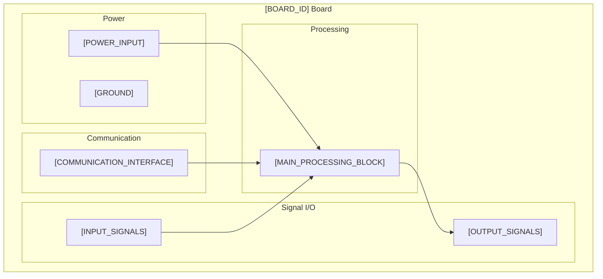

# PCB Design Specification Template

<!-- LLM INSTRUCTIONS: Replace all [PLACEHOLDERS] with project-specific information. The top of the file is a yaml frontmatter -->

# Description

<!-- LLM: Write 2-3 sentences describing what the board is and its primary function -->

[BOARD_ID] is a [BOARD_TYPE] that [PRIMARY_FUNCTION]. [ADDITIONAL_DETAILS_1_2_SENTENCES].

# Features

<!-- LLM: List key technical features and capabilities -->

- [FEATURE_1]
- [FEATURE_2] 
- [FEATURE_3]
- [FEATURE_4]
- [FEATURE_5]

# Applications

<!-- LLM: List typical use cases and target applications -->

- [APPLICATION_1]
- [APPLICATION_2]
- [APPLICATION_3]
- [APPLICATION_4]

# Block Diagram

<!-- LLM: Create a Mermaid block diagram showing the board's main functional blocks and interfaces -->

