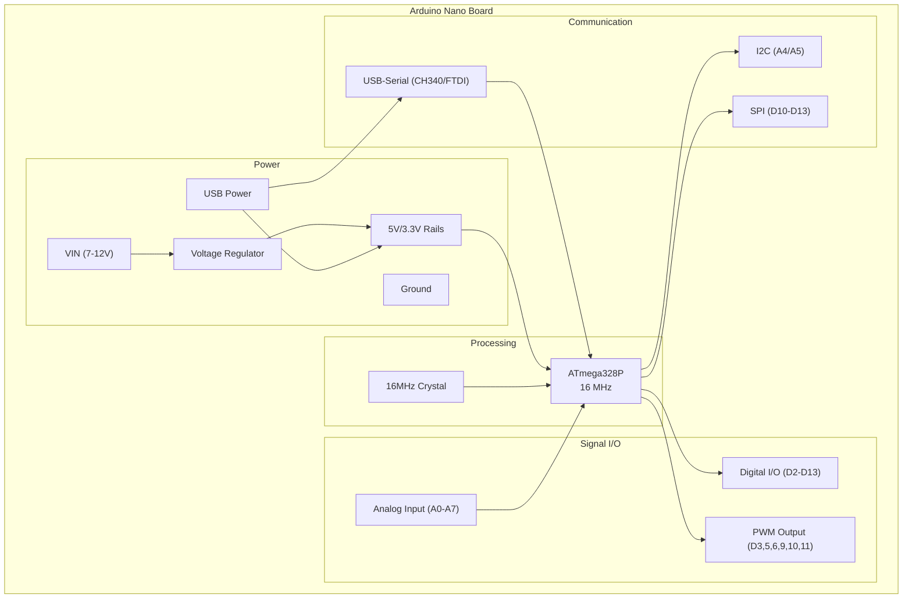

# PCB Design Specification: Arduino Nano

# Description

The Arduino Nano is a compact microcontroller board based on the ATmega328P. It offers similar functionality to the Arduino Uno but in a smaller, breadboard-friendly form factor. The board is designed for embedded applications where space is at a premium while maintaining full Arduino ecosystem compatibility.

# Features

- ATmega328P microcontroller (16 MHz)
- 32 KB Flash memory (2 KB used by bootloader)
- 2 KB SRAM, 1 KB EEPROM
- 14 digital I/O pins (6 PWM outputs)
- 8 analog input pins
- USB connectivity via Mini-B or USB-C connector
- Breadboard-friendly DIP-30 pin layout
- Power via USB or external 7-12V supply
- Compact size: 18mm x 45mm

# Applications

- Embedded system prototyping
- IoT sensor nodes
- Robotics control systems
- Educational electronics projects
- Wearable electronics
- Home automation controllers

# Block Diagram

