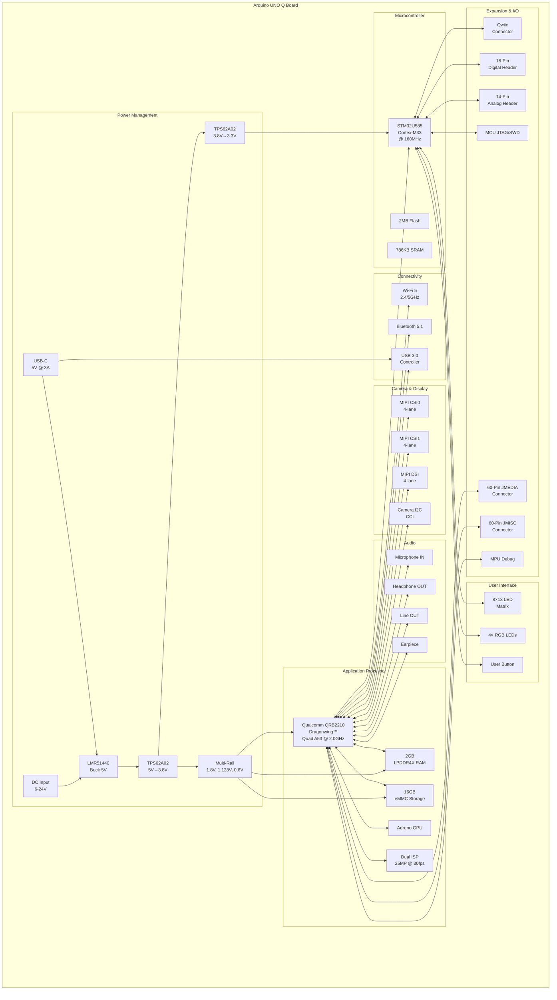

# PCB Design Specification: Arduino UNO Q

# Description

The Arduino UNO Q is a revolutionary dual-processor development board that combines the power of a Qualcomm application processor with an STM32 microcontroller. This board bridges the gap between traditional microcontroller development and modern Linux-based computing, making it ideal for AI, machine learning, computer vision, and advanced IoT applications while maintaining compatibility with the Arduino ecosystem.

The board features the Qualcomm QRB2210 Dragonwing™ (quad-core Arm® Cortex®-A53 @ 2.0 GHz) running Linux Debian OS alongside an STM32U585 (Arm® Cortex®-M33 @ 160 MHz) running Arduino Core on Zephyr OS. This unique architecture allows developers to leverage high-level computing capabilities while maintaining real-time control and Arduino shield compatibility.

# Features

## Processors
- **MPU**: Qualcomm QRB2210 Dragonwing™
  - Quad-core Arm® Cortex®-A53 @ 2.0 GHz
  - Adreno GPU for 3D graphics acceleration
  - Dual Image Signal Processors (ISPs) supporting up to 25 MP @ 30 fps
  - Linux Debian OS
- **MCU**: STM32U585AII6TR
  - Arm® Cortex®-M33 @ 160 MHz
  - 2 MB Flash memory
  - 786 KB SRAM
  - Arduino Core on Zephyr OS

## Memory & Storage
- 2GB LPDDR4X RAM (MT53E512M32D1ZW)
- 16GB eMMC storage (EMMC16G-MW28-GA01)

## Power Management
- Input: 6-24V DC or USB-C (5V @ 3A)
- Multi-rail DC-DC conversion:
  - LMR51440SDRRR: 6-24V to 5V buck converter
  - TPS62A02APDDCR: 5V to 3.8V and 3.8V to 3.3V
  - Multiple voltage rails: 5V, 3.8V, 3.3V, 1.8V, 1.128V, 0.6V
- Power protection with TVS diodes and ESD protection

## Connectivity
- Dual-band Wi-Fi 5 (2.4/5 GHz) with onboard antenna
- Bluetooth® 5.1 with onboard antenna
- USB-C connector with SuperSpeed USB 3.0
- USB 2.0 High-Speed interface

## User Interface
- 8×13 Blue LED matrix (104 LEDs total)
- 4× RGB user-controllable LEDs (2 for MPU, 2 for MCU)
- 1× User push-button
- Power indicator LED

## Interfaces & Expansion
- **Digital**: I2C/I3C, SPI, UART, PWM, CAN, GPIO
- **Analog**: ADC (12-bit), OPAMP
- **Debug**: JTAG, SWD, TRACE
- **Camera**: Dual MIPI CSI interfaces (4-lane each) via high-density connectors
- **Display**: MIPI DSI (4-lane) via high-density connector
- **Audio**: 
  - Microphone IN (differential)
  - Headphone OUT (stereo)
  - Line OUT (stereo)
  - Earpiece output
- **Expansion**:
  - 1× Qwiic connector (3.3V, I2C)
  - 18-pin digital header
  - 14-pin analog/control header
  - 60-pin high-density JMEDIA connector
  - 60-pin high-density JMISC connector
  - Arduino UNO shield compatible headers

## Mechanical
- Form factor: Arduino UNO (68.85mm × 53.34mm)
- 4× M3 mounting holes
- Compatible with Arduino shields and accessories

# Applications

## AI & Machine Learning
- On-device AI inference with Adreno GPU acceleration
- Computer vision applications with dual ISPs
- Neural network training and deployment
- Edge AI for smart cameras and surveillance systems

## Computer Vision
- Dual 25MP camera support @ 30fps
- Real-time video processing and analytics
- Facial recognition and object detection
- Autonomous navigation systems
- Industrial inspection and quality control

## IoT & Edge Computing
- Smart home automation hubs
- Industrial IoT gateways
- Environmental monitoring stations
- Wireless sensor networks
- Edge computing nodes with cloud connectivity

## Multimedia & Audio
- Digital audio processing and effects
- Voice recognition and natural language processing
- Audio streaming and recording devices
- Smart speakers and voice assistants
- Portable media players

## Robotics
- High-level path planning and decision making (MPU)
- Real-time motor control and sensor fusion (MCU)
- Autonomous navigation with camera vision
- Human-robot interaction systems
- Drone control and stabilization

## Education & Research
- Teaching embedded systems and Linux
- Prototyping advanced IoT solutions
- Research in edge AI and ML deployment
- University engineering projects
- STEM education platforms

# Block Diagram

# System Architecture

## Dual-Processor Communication
The Arduino UNO Q features a sophisticated dual-processor architecture where the MPU and MCU communicate via multiple interfaces:
- **LPUART1**: Primary serial communication between processors
- **SPI3**: High-speed data exchange
- **Shared GPIO**: Control and handshaking signals

## Power Architecture
The power system is designed to provide clean, stable power to all components:
1. Input protection with TVS diodes and ESD protection
2. Primary 5V rail generation from 6-24V input or USB-C
3. Secondary 3.8V rail for VBAT and intermediate voltage
4. 3.3V rail for MCU and peripherals
5. Specialized rails for LPDDR4X (1.128V, 0.6V) and eMMC (1.8V, 2.96V)

## Memory Organization
- **MPU Side**: 2GB LPDDR4X for Linux OS and applications, 16GB eMMC for storage
- **MCU Side**: 2MB Flash for firmware, 786KB SRAM for real-time operations

# Pin Assignments

## Digital Header (18-Pin)
- USART1 (TX/RX)
- JTAG/SWD signals
- SPI2 (NSS, CLK, MISO, MOSI)
- I2C2 (SCL, SDA)
- GPIO pins (PB0, PB1, PB2, PB8, PA11, PA12)
- Power: GND, VREFP

## Analog Header (14-Pin)
- BOOT0, NRST
- Analog pins (PA4, PA5, PA6, PA7, PC0, PC1)
- Power: DC_IN, USB_VBUS, 3.3V, GND

## JMEDIA Connector (60-Pin)
- MIPI DSI (4-lane) for display
- MIPI CSI0 (4-lane) for camera
- MIPI CSI1 (4-lane) for camera
- Camera I2C (CCI0, CCI1)
- Camera MCLK (2 channels)
- Power rails

## JMISC Connector (60-Pin)
- MCU PSSI interface (parallel camera)
- MCU Trace debug signals
- Audio interfaces (Mic, Headphone, Line, Earpiece)
- GPIO expansion (MPU and MCU)
- Additional I2C and control signals
- Power rails (3.3V, 1.8V, VBAT, VCOIN)

# Design Considerations

## Signal Integrity
- Differential pair routing for USB 3.0, MIPI CSI/DSI, and LPDDR4X
- Controlled impedance traces for high-speed signals
- Length matching for memory interfaces
- AC coupling capacitors (330nF) for USB 3.0 signals
- Series resistors (0Ω) for flexibility in signal routing

## Power Integrity
- Multiple decoupling capacitors per power rail
- Star grounding topology
- Separate analog and digital grounds
- Ferrite beads for noise filtering on sensitive rails

## Thermal Management
- Exposed pad thermal relief on power components
- Strategic component placement for heat dissipation
- Ground plane for heat spreading

## EMI/EMC
- TVS diodes and ESD protection on all external interfaces
- Common mode chokes on differential pairs
- Ground shielding on high-speed signals
- Proper PCB stack-up with ground planes

# Software Ecosystem

## MPU (Qualcomm QRB2210)
- **OS**: Linux Debian with upstream support
- **Development**: Python, C/C++, containerized applications
- **Frameworks**: TensorFlow Lite, OpenCV, ROS
- **Package Management**: APT (Debian packages)

## MCU (STM32U585)
- **OS**: Arduino Core on Zephyr OS
- **Development**: Arduino IDE, PlatformIO, STM32CubeIDE
- **Language**: C/C++, Arduino sketches
- **Real-Time**: FreeRTOS capabilities via Zephyr

## Arduino App Lab
Integrated development environment that allows seamless development across both processors, supporting Arduino sketches, Python scripts, and containerized AI models.

# Compliance & Certifications

## Regulatory
- UKCA (UK Conformity Assessed) marking
- CE marking (implied by design)
- FCC compliance for wireless modules
- RoHS compliant

## Standards
- USB 3.0 specification compliance
- MIPI DSI/CSI specification compliance
- I2C, SPI, UART standard interfaces
- Arduino UNO mechanical compatibility

# Bill of Materials Highlights

## Key Components
- **MPU**: Qualcomm QRB2210 Dragonwing™
- **MCU**: STM32U585AII6TR (BGA176)
- **RAM**: MT53E512M32D1ZW-046 (2GB LPDDR4X, BGA200)
- **Storage**: EMMC16G-MW28-GA01 (16GB, BGA153)
- **Power**: LMR51440SDRRR (4A buck), TPS62A02APDDCR (2A buck-boost)
- **USB**: USB Type-C 24-pin connector with ESD protection
- **Protection**: RCLAMP series TVS diodes, PESD5V0X1BL diodes

## Passive Components
- 0402 and 0603 resistors and capacitors primarily
- 0805 capacitors for bulk decoupling
- Ferrite beads and inductors for power filtering

# Revision History

| Version | Date | Description |
|---------|------|-------------|
| 1.0 | 2025/10/22 | Initial design documentation |

# References

- Arduino UNO Q Product Page: https://www.arduino.cc/product-uno-q
- Qualcomm QRB2210 Documentation
- STM32U585 Reference Manual
- LPDDR4X JEDEC Standard
- Arduino App Lab Documentation

# License

This design documentation is provided for reference and educational purposes.
Arduino and Arduino UNO are trademarks of Arduino SA.
Qualcomm and Dragonwing are trademarks of Qualcomm Incorporated.

---
*Document prepared by Nasheed Ur Rehman*
*Last updated: October 22, 2025*

